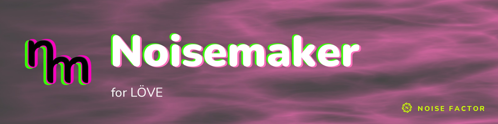

<!-- repo-hero -->
<a href="https://noisemaker.app/"></a>

<sub>Open source from <a href="https://noisefactor.io">Noise Factor</a> &middot; <a href="https://github.com/noisefactorllc">more projects</a></sub>

# Noisemaker for LÖVE

Open gaps are the
[issues labelled `gap`](https://github.com/noisefactorllc/noisemaker-for-love2d/issues?q=is%3Aissue+label%3Agap).

> Run **Noisemaker**'s procedural visuals in **LÖVE** games, on the GPU.

## What is this?

**Noisemaker** is a procedural visual engine. You write short text programs, chains of effects, and
it renders live, animated GPU textures:

```
search synth, filter
noise(scaleX: 60).bloom().write(o0)
render(o0)
```

That language is Noisemaker's **DSL**. The original engine runs in the browser at
[noisedeck.app](https://noisedeck.app).

**Noisemaker for LÖVE** is a Lua library that runs the same programs in [LÖVE](https://love2d.org).
It compiles the DSL in Lua and runs the resulting render graph with `love.graphics` shaders and
canvases. It contains the native Lua compiler, the full shader catalog of 210 effects, a render-graph
executor, Portable effect registration, and a standalone viewer.

It is self-contained: the runtime needs no Node.js, browser, or network connection.

## What you can do with it

- **Generate animated canvases** from a short program and draw them in your game.
- **Feed your own textures** into a program: any LÖVE `Image` or `Canvas`, including the `media()`
  effect's image input.
- **Drive programs with audio and MIDI** snapshots that your game supplies each frame.
- **Register your own effects** in the Portable format, with GLSL programs.
- **Preview DSL files** in the standalone viewer: drop a file onto its window.

## Requirements

- **Desktop LÖVE 11.5** on LuaJIT 2.1 (Lua 5.1 syntax plus LuaJIT's `bit` module) with GLSL 3
  support. Treat that as a proposed API baseline, not a claim that it is the newest release or that
  all 11.5 devices can run the catalog.
- **A real graphics context** to render.
- The qualified configuration is macOS 14.8.3 on Apple M2 (see
  [What works and what does not](#what-works-and-what-does-not)). Windows and Linux each require
  actual host qualification. Mobile support is a later qualification stage, not an initial support
  claim.

## Install

No packaged release is published yet. Copy the `noisemaker/` directory from this repository, or from
the source zip that `scripts/package` builds, into your LÖVE game root. Then `require('noisemaker')`.

## Your first render

Put this in the game's `main.lua` and run `love /path/to/game`:

```lua
local nm = require('noisemaker')
local renderer, canvas, elapsed = nil, nil, 0

function love.load()
  local graph, errors = nm.compile('search synth\nnoise(seed: 1).write(o0)\nrender(o0)')
  assert(graph, errors and errors[1] and errors[1].message)
  local w, h = love.graphics.getDimensions()
  renderer, errors = nm.newRenderer(graph, {width = w, height = h})
  assert(renderer, errors and errors[1] and errors[1].message)
end

function love.update(dt)
  elapsed = elapsed + dt
  local errors
  canvas, errors = renderer:render({time = elapsed})
  assert(canvas, errors and errors[1] and errors[1].message)
end

function love.draw()
  if canvas then
    love.graphics.setColor(1, 1, 1, 1)
    love.graphics.draw(canvas, 0, 0)
  end
end

function love.resize(w, h)
  assert(renderer:resize(w, h))
  canvas = nil
end

function love.quit()
  if renderer then assert(renderer:release()) end
end
```

Every DSL program has the same shape:

- Name the namespaces it uses (`search synth, filter`).
- Chain the effects.
- Write the result to an output surface (`.write(o0)`).
- Select a surface to show (`render(o0)`).

To preview programs without writing a game, run the standalone viewer with
`love noisemaker-love2d.love`, then drop a DSL file onto its window. `scripts/package` builds it. The
viewer supports file drop or F5 reload, R reset, Space pause, bracket keys to select a numeric
parameter, and plus/minus to change it. The source zip also includes `examples/viewer/`,
`tests/consumer/`, and the Portable fixtures used by those consumer checks.

## Use it in your own game

`nm.compile(source)` produces a graph; `nm.newRenderer(graph, {width = width, height = height})`
prepares it; `renderer:render({time = 0})` returns a GPU-resident Canvas. `nm.registerEffect(definition)`
registers a validated Portable effect with GLSL programs.

The returned Canvas is borrowed until the next render, resize, parameter replacement, reset, or
release. Use `renderer:copyTo(destination)` to retain a frame in a distinct host-owned Canvas. Unbind
the borrowed output from `love.graphics.setCanvas` before replacing or releasing it; otherwise the
operation returns `ERR_RESOURCE_IN_USE` and preserves the active renderer. Parameter step indexes are
zero-based. Resizing preserves the frame clock; `reset()` clears feedback and resets the clock.

Pass `texturePooling = true` in renderer options to share temporary Canvases with identical
descriptors and disjoint lifetimes. It defaults to false, as in the reference. Feedback, persistent
resources, partial or conditional draws, blending, mipmaps, and volume textures retain separate
storage. In a gamma-correct host, create data images with `love.graphics.newImage(data, {linear = true})`
when shader inputs must retain their original channel values; the library creates its own data images
this way.

### Host inputs

`renderer:setInput(binding, texture)` borrows a host `Texture` and accepts top-left image coordinates
by default. It flips the texture on the GPU for shader sampling and refreshes that copy on each render,
so edits to a host Canvas appear in the next frame. Call
`setInput(binding, texture, {origin = 'bottom-left'})` for a texture already in shader coordinates, or
`setInput(binding, nil)` to clear it. The caller retains ownership of the supplied texture; the
renderer releases only its own copy.

`setInput` accepts a LÖVE Texture, such as an Image or Canvas, rather than ImageData. Create an Image
from data with `love.graphics.newImage(data, {linear = true})`. The `media()` effect uses the external
binding `imageTex`: `renderer:setInput('imageTex', hostTexture)`. Binding preserves the program's
`imageSize`; call `renderer:setParameter(mediaStep, 'imageSize', {w, h})` only when the host should
replace the authored layout size. Inspect `graph.passes[*].inputs` for each pass's sampler-to-resource
mapping; these maps also contain internal graph resources.

Audio capture, MIDI devices, text rasterization, and mesh loading belong to the host. Supply snapshots
to each render. Omitting the audio field clears the previous snapshot and sends zero spectrum and
waveform uniforms; passing an empty audio table creates a snapshot with zero spectrum and waveform
samples padded to 0.5. Omitting the MIDI field clears its previous snapshot. Audio arrays use Lua's
one-based indexing and are padded to 16 FFT bands, 128 spectrum bins, and 128 waveform samples. MIDI
channels are 1–16; note keys are 0–127 with velocities 0–127. String keys make the note map
unambiguous, including note zero:

```lua
local audio = {
  low = .2, mid = .3, high = .1, vol = .25, raw = .25, rawReady = true,
  fft = {.1}, spectrum = {.2}, waveform = {.5},
}
local midi = {clockCount = 24, channels = {
  [1] = {key = 60, velocity = 100, gate = 1, time = 0, keys = {['60'] = 100}},
}}
local canvas, errors = renderer:render({
  time = elapsed, deltaTime = dt, frame = frameIndex, audio = audio, midi = midi,
})
```

### Portable effects

Register a definition before compiling a program that uses it. Each pass's `program` names a matching
entry in `shaders`, containing `glsl` or a `vertex`/`fragment` pair:

```lua
local ok, errors = nm.registerEffect({
  name = 'Red', namespace = 'user', func = 'red',
  globals = {gain = {type = 'float', default = 1, uniform = 'gain', min = 0, max = 1}},
  passes = {{program = 'main', inputs = {}, outputs = {fragColor = 'outputTex'}}},
  shaders = {main = {glsl = [[#version 300 es
precision highp float;
uniform float gain;
out vec4 fragColor;
void main() { fragColor = vec4(gain, 0.0, 0.0, 1.0); }
]]}},
})
assert(ok, errors and errors[1] and errors[1].message)
local graph = assert(nm.compile('search user\nred().write(o0)\nrender(o0)'))
```

## What works and what does not

The native compiler matches the locked upstream graphs for the catalog defaults, 1,815 choice and
boolean parameter variants, 912 shared programs, and 52 authored upstream fixtures. Function-valued
parameters are compared by evaluation on deterministic state vectors as well as by graph structure.
The extracted package runs a CPU compilation check and a real LÖVE GPU check, including Portable GLSL,
failed hot replacement, persistent resize, feedback, and 100 renderer lifecycles.

The 2026-10-07 same-run qualification against upstream `8e5835932a7297d360b943200b42953224eea0a4`
executed all 3,466 cases with unchanged candidate source: 3,371 informative exact cases, 16
informative strict cases, and 79 uninformative cases. Every one of the 210 effects has informative
evidence. Near, deferred, skipped, failed, and missing counts are all zero. Strict comparison requires
maximum channel error ≤ 2.001 in 8-bit units and SSIM ≥ 0.98, with matching dimensions and alpha.

| Qualification configuration | Result |
|---|---|
| macOS 14.8.3 arm64, Apple M2, LÖVE 11.5, LuaJIT 2.1.1700008891, OpenGL 4.1 Metal 88.1 | Full catalog parity, native GPU regressions, and clean-package consumer checks pass |
| Firefox 153.0, build 20260722115600, Apple M2 WebGL2 | Same-run reference renderer |
| Windows and Linux | Not yet qualified; no platform support claim |

The comparison used the common 8,192-pixel texture limit; native LÖVE retains its 16,384-pixel limit
and separately passes the larger volume-atlas regression. This result qualifies the listed
configuration, not every device running LÖVE 11.5. Full binary captures, per-case results, source
hashes, and browser identity are generated under `parity/out/`; they are excluded from the runtime
package.

## How it works

Noisemaker turns a DSL program into a **render graph**, a normalized list of GPU passes. That graph is
the seam every Noisemaker port targets. Noisemaker for LÖVE ports the compiler to Lua, adapts each
effect's GLSL for LÖVE, and executes the graph with `love.graphics` shaders and canvases.

→ **[ARCHITECTURE.md](ARCHITECTURE.md)** (scope, runtime design, compatibility, evidence, open
capability gates) · **[PORTING-GUIDE.md](PORTING-GUIDE.md)** (GLSL adaptation, Lua semantics,
graphics state, validation rules) · **[docs/IMPLEMENTATION-PLAN.md](docs/IMPLEMENTATION-PLAN.md)**
(work packages and acceptance checks).

## How it is checked

The commands below run from a repository checkout; the distributed runtime zip does not contain
`scripts/`, `tools/`, or the full parity corpus. Install the development dependencies with `npm ci`
and the reference browser with `npx playwright install firefox`. Reference tools use Node.js and
Playwright with Firefox hardware WebGL2 as the canonical pixel authority; each run records its browser
version and GPU identity. Packaging uses Python's standard library. Native checks require LÖVE; GPU
checks require a real graphics context.

Set `NM_REFERENCE_ROOT` to a clean upstream Noisemaker checkout at the commit in
`parity/reference.json`. Without it, the tools obtain an immutable source archive from the locked
repository. The lock identifies the comparison authority, not a product build version.

```sh
NM_REFERENCE_ROOT=/path/to/noisemaker LOVE_BIN=/path/to/love scripts/test
NM_REFERENCE_ROOT=/path/to/noisemaker node tools/export-reference.mjs --out /tmp/love-reference.json
NM_REFERENCE_ROOT=/path/to/noisemaker node tools/import-catalog.mjs --check
love parity/capabilities
LOVE_BIN=/path/to/love scripts/test-gpu
LOVE_BIN=/path/to/love scripts/parity-summary --tier all --out /tmp/love-parity
LOVE_BIN=/path/to/love scripts/benchmark /tmp/love-benchmark.json
LOVE_BIN=/path/to/love scripts/package
```

- `scripts/test` checks reference identity, deterministic imports, native compiler stages and graphs,
  shader-adapter rewrites, expressions, automation, input snapshots, hook lifecycle, and CPU-generated
  overlay pixels. Its overlay comparison uses real browser and LÖVE GPU contexts. To regenerate
  catalog data after a deliberate authority update, omit `--check` from the import command.
- `scripts/test-gpu` runs the shader, runtime, and consumer regressions.
- `love parity/capabilities` prints `CAPABILITIES-RESULT` with host identity, pixel checks, and
  separate pass, fail, and unsupported counts. Set `NM_CAPABILITIES_RESULT` to save that line outside
  the source tree. It exits nonzero when any required probe fails or is unsupported. The probes include
  raw replacement RGBA, float targets, MRT, half packing, the remap data-texture lowering, custom
  vertex behavior, volume textures, and graphics-state recovery. Capability passes do not establish
  reference-versus-port parity or platform support.
- `scripts/package` builds a source zip, extracts it into a temporary clean directory, and runs CPU
  and real GPU consumer checks from the extracted copy. Its outputs are `dist/noisemaker-love2d.zip`
  and a standalone `dist/noisemaker-love2d.love` viewer.

The CI workflow runs the capability, source, GPU regression, full catalog parity, and package checks
on every code push. It requires an allowlisted GPU runner. There are no release or deployment
workflows.

## Contributing

Contributions follow the Noise Factor
[contributing policy](https://github.com/noisefactorllc/.github/blob/main/CONTRIBUTING.md) and
[Code of Conduct](https://github.com/noisefactorllc/.github/blob/main/CODE_OF_CONDUCT.md).

## Repo layout

```
noisemaker/        the runtime: compiler, effect catalog, render-graph executor, shaders
examples/viewer/   the standalone viewer
tests/             unit, compiler, runtime, shader, consumer and benchmark tests
parity/            authority lock, corpus, programs, runner and Portable fixtures
scripts/           test, GPU test, parity, benchmark and package entry points
tools/             reference export, catalog and shader import, graders and gate checks
docs/              implementation plan
```

## License

MIT (see [LICENSE](LICENSE)). Skia-derived raster code retains its BSD license notices in the source
files. Use of the Noisemaker and Noise Factor names in derivative products is subject to the
[Trademark Policy](TRADEMARK.md).

Copyright © 2026 Noise Factor LLC
